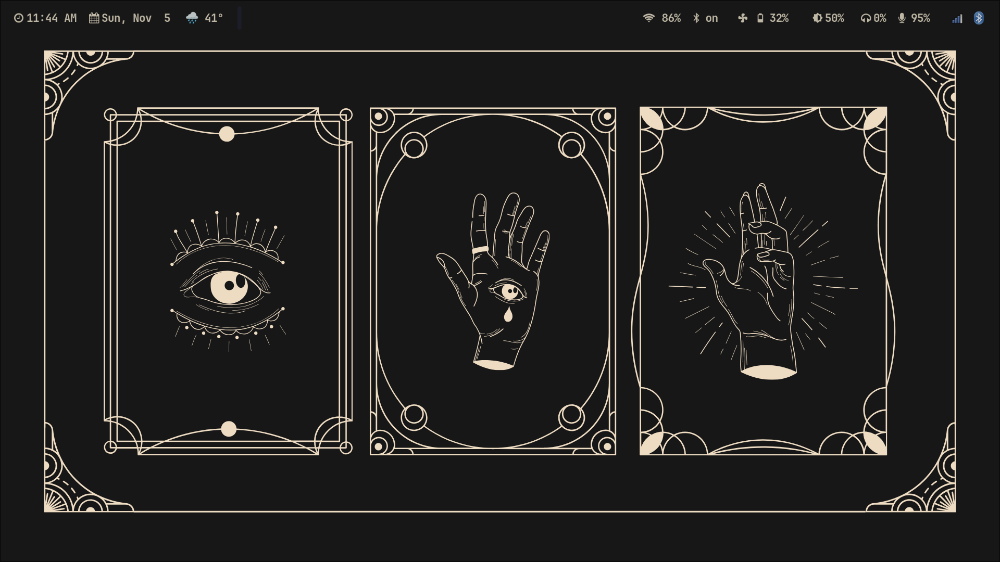
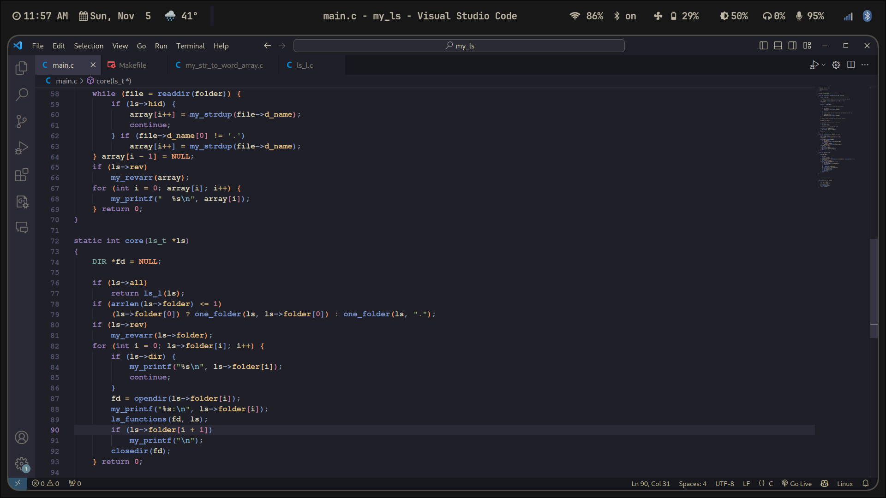
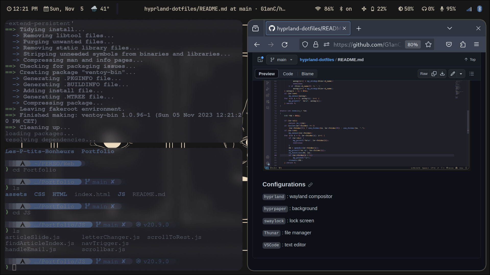

# My .dotfiles

The Hyprland (ArchLinux) configuration i'm currently using.
<br>
<br>

  &ensp;[<kbd> <br> Dependencies <br> </kbd>](#Dependencies)&ensp;
  &ensp;[<kbd> <br> Installation <br> </kbd>](#Installation)&ensp;
  &ensp;[<kbd> <br> Configurations <br> </kbd>](#Configurations)&ensp;
  &ensp;[<kbd> <br> Home <br> </kbd>](#Home)&ensp;
  &ensp;[<kbd> <br> VSCode <br> </kbd>](#VSCode)&ensp;
  &ensp;[<kbd> <br> Multiple <br> </kbd>](#Multiple)&ensp;
  &ensp;[<kbd> <br> DashBoard <br> </kbd>](#Dashboard)&ensp;

  
### Installation

```bash
sudo pacman -S hyprland 
cd ~/.config/
sudo 
```
<br>

### Configurations

```hyprland``` : wayland compositor

```waybar``` : status bar 

```hyprpaper``` : background 

```swaylock``` : lock screen

```Thunar``` : file manager

```VSCode``` : text editor ('Kanagawa' theme)

```wofi``` : dashboard

```firefox``` : web manager ('NordOrange' theme)

### Home



### VSCode



### Multiple pages



### Dashboard


