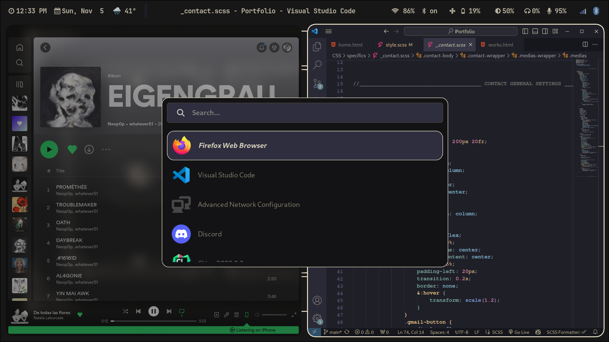

# My .dotfiles

The Hyprland (ArchLinux) configuration i'm currently using.

### Home page


### Code editor opened


### Multiple pages opened


### dashboard



### Configurations

```hyprland``` : wayland compositor

```hyprpaper``` : background 

```swaylock``` : lock screen

```Thunar``` : file manager

```VSCode``` : text editor

